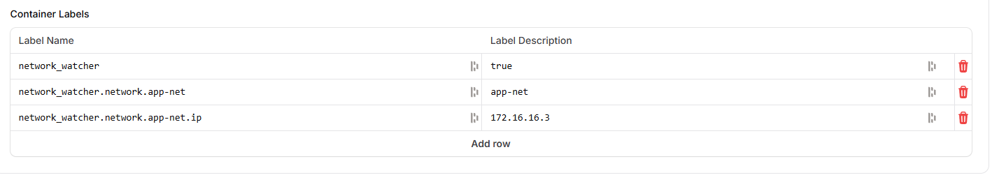

# pelican-panel-netwatch
A docker network watcher to automatically add containers to networks based on labels used for Pelican Panel

## How to Install

This can be easily installed using Docker compose.

### docker-compose.yml

```docker-compose
services:
  network-watcher:
    image: ghcr.io/s3tupw1zard/pelican-panel-netwatch:latest
    volumes:
      - /var/run/docker.sock:/var/run/docker.sock
    restart: always
    environment:
        SLEEP_INTERVAL: "30" # Sleep interval in seconds
```

Start the container using `docker compose up -d`.

## Why does this project exist?

You can use this to automatically add docker containers created by Pelican panel to any network that you've created with a custom subnet.
To create such a network you could use a command like this:

```bash
sudo docker network create --subnet=172.16.0.0/16 --gateway=172.16.0.1 --attachable <network_name>
```

Since I don't want every game server to be available publicly I'm using Netbird to securely access them. Therefore I set up a route to this docker subnet.
You could also use this for maybe a web server inside docker to reverse proxy to a web map or something else.

## How to configure?

Containers that should be watched need to have the label `network_watcher: "true"` to be detected:

Under `Environment` when editing your server in the admin panel you need to add the labels like shown below. Keep in mind to use your own network name and subnet that you chose.




Since my network is called `app-net` I'm also using here `app-net` in the label and label description field.
Keep in mind that you also need to choose a ip that is not already used since you can't assign the same address twice.


After adding the labels and starting the both your game server and Network Watcher container your network should be accessible for your game server.